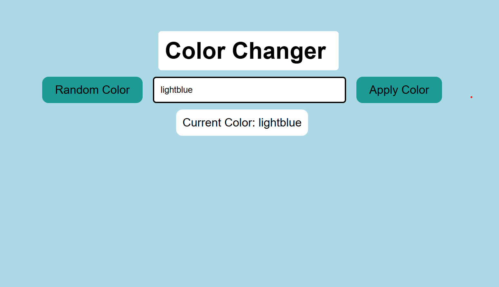

# 🎨 Color Changer

A simple and interactive **Color Changer** web application built using **HTML, CSS, and JavaScript**. Users can either generate a random color or apply a custom color by entering a valid color name or HEX code.

---

## 🌐 Live Demo

🔗 https://abhi003cs.github.io/Color-Changer/

## 📸 Screenshot



> **Note:** If your screenshot is in the project root folder, replace `images/screenshot.png` with `screenshot.png`.

---

## ✨ Features

- 🎲 Generate a random background color
- 🎨 Apply a custom color using a color name or HEX code
- 🌈 Displays the currently applied color
- ⚡ Instant background color update
- 📱 Simple and responsive user interface

---

## 🛠️ Technologies Used

- HTML5
- CSS3
- JavaScript (ES6)

---

## 📂 Project Structure

```text
Color-Changer/
│── index.html
│── style.css
│── script.js
│── README.md
└── images/
    └── screenshot.png
```

---

## 🚀 How to Run

1. Clone the repository

```bash
git clone https://github.com/your-username/Color-Changer.git
```

2. Open the project folder.

3. Double-click **index.html** or open it in your preferred web browser.

---

## 📖 How to Use

- Click **Random Color** to generate a random background color.
- Enter any valid **color name** (e.g., `red`, `blue`) or **HEX code** (e.g., `#3498db`) in the input field.
- Click **Apply Color** to change the background.

---

## 🔮 Future Improvements

- 🎨 Color picker input
- 📋 Copy HEX code to clipboard
- 🕒 Color history
- ❤️ Save favorite colors
- 🌙 Dark/Light mode

---

## 👨‍💻 Author

**Abhishek Ranjan**
